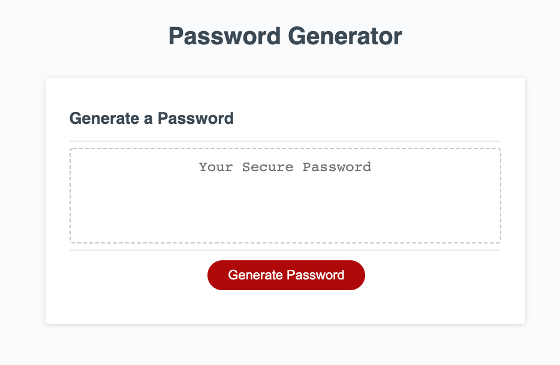
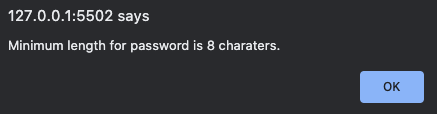
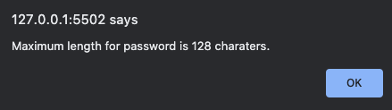
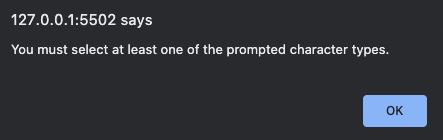
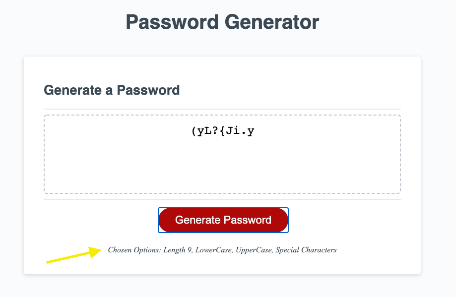
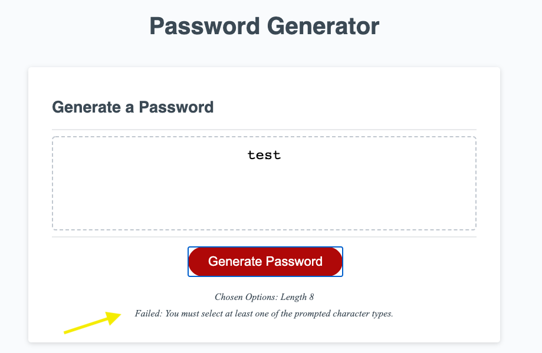

# Password Generator

This tool generates secure password for a given length. Minimum - requirement is -
- minimum length is 8
- maximum length is 128
- password must have at least one character from the following character sets: special character, numbers, uppercase and lowercase letters

## Getting Started
Code at: [github link](https://github.com/manzur-shaheed/ms-password-generator)

Live at: [github pages](https://manzur-shaheed.github.io/ms-password-generator/)

You can clone code from [github link](https://github.com/manzur-shaheed/ms-password-generator) and run it locally on your computer.

### Prerequisites

A computer with browser that supports javascript. To clone code from github, you need to have aceess to Internet. Also your computer should have Terminal (Unix) software installed. For Windows users, you can get it from https://www.cygwin.com/. For Mac users, it comes pre-installed with MacOS. 

### Installing

- Open a terminal.  
- Create a directory for this project.
- Change current directory to this project direcory.
- Issue the following command -

```
git clone git@github.com:manzur-shaheed/ms-password-generator.git
```
You can then run this tool by opening index.html page from this directory in a browser.
## Deployment

Following images show how the software runs:
- Initial window 


- When you click on ```Generate Password``` it will prompt you for a password length, if you enter less than 8, it will display 

 

if you enter more than 128 as length, it will display 



once you enter correct length between 8-128 inclusive, it will prompt you a series of questions whether you want one of [Special Characters, Numbers, Upper and Lower case letters]. You need to select at least one charater type, otherwise you will get an error 



- If you meet all requirement, a secure password will be gerated and displayed in the main window 

 

It also display what options you chose at the bottom of the window (yellow &#8594;).

- If you fail to meet password generation criteria, it will display the reason for the failure (yellow &#8594;) 


- Enjoy!
## Built With

* [HTML](https://developer.mozilla.org/en-US/docs/Web/HTML)
* [Javascript](https://developer.mozilla.org/en-US/docs/Web/JavaScript)


## Acknowledgments
* **Billie Thompson** - [PurpleBooth](https://github.com/PurpleBooth) for the README Template.

